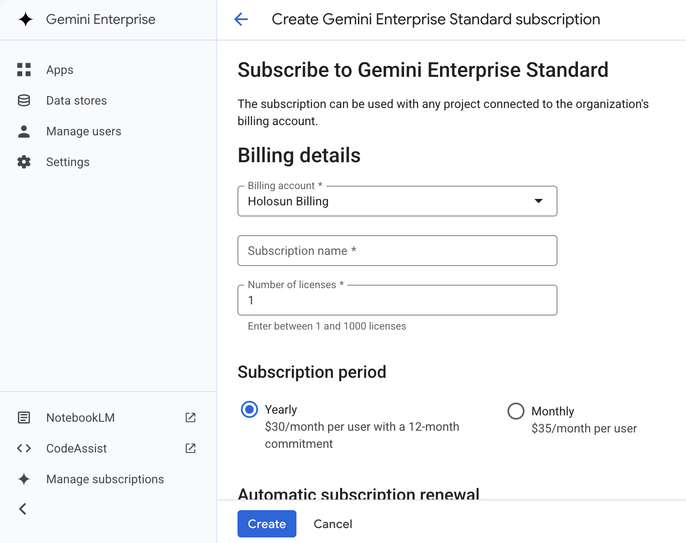

# Consuming this ADK agent from Gemini Enterprise

This doc shows what's needed to register a deployed instance of the
platform with [Google Gemini Enterprise](https://cloud.google.com/products/agentspace)
(formerly Agentspace) as an A2A agent. After registration, the platform's
public skills appear as tools in Gemini Enterprise apps — internal
users invoke them through Gemini Enterprise's UI without ever needing
direct backend access.

Verified working against
[`sunholo-data/gde-ap-agent`](https://github.com/sunholo-data/gde-ap-agent)'s
deployed card at `https://gde-ap-agent-blqtqfexwa-ew.a.run.app/.well-known/agent.json`
on 2026-06-07 — see `docs/design/template/template-a2a-spec-compliance.md` (G43).

---

## Pick first: stand up your own GE app, or register against someone else's?

Two operational patterns covered in this doc; a third (publish to
Cloud Marketplace so any GE customer can install us) is tracked
separately in
[cloud-marketplace-publishing.md](./cloud-marketplace-publishing.md).
Pick before running anything — the choice shapes who pays the
$30/seat/month subscription, who sees the agent in their Console, and
how much per-fork setup work there is.

### Pattern A — Register against an existing Gemini Enterprise app

You don't run the subscription; whoever owns the GE app does. They
grant your Google account (or your CI service account)
`roles/discoveryengine.editor` on their engine, and you point
`--gemini-enterprise-app-id` at their engine path. Your fork's
platform deployment still runs in your own GCP project (you pay
runtime costs); only the GE registration uses the shared engine.

**When this fits:**
- Internal forks within a single org (e.g. a company runs three
  agent demos against one shared Gemini Enterprise sub)
- Showcase / marketplace patterns where one team curates many
  registered agents from many fork operators
- You don't want to buy a $30/seat sub just to test discovery

**One-time grant the GE-app owner runs:**

```bash
ENGINE="projects/<their-project-number>/locations/global/collections/default_collection/engines/<their-engine-id>"
gcloud beta discovery-engine engines add-iam-policy-binding "$ENGINE" \
  --member="user:you@example.com" \
  --role="roles/discoveryengine.editor"
# OR for CI: --member="serviceAccount:ci-sa@your-project.iam.gserviceaccount.com"
```

(`editor` lets you register + update; `admin` adds delete + sub changes.)

**Per-fork registration you run:**

```bash
agents-cli register-gemini-enterprise \
  --registration-type a2a \
  --agent-card-url https://<your-deployed-host>/.well-known/agent.json \
  --gemini-enterprise-app-id "$SHARED_GE_APP_ID" \
  --display-name "<Your Fork Name>" \
  --deployment-target cloud_run
```

For CI ergonomics, drop the engine path into your `cloudbuild.yaml`
substitutions / `--set-env-vars` once so the registration step is
just `--gemini-enterprise-app-id $SHARED_GE_APP_ID` — no copy-pasted
long resource paths in every fork's CI config.

### Pattern B — Stand up your own Gemini Enterprise app

Fully self-contained. You create the project, link your billing, buy
your own subscription, create your own app. No external dependency,
no shared visibility with anyone else's GE app. This is what
[`make setup-gemini-enterprise`](#quick-start-bootstrap-a-fresh-project)
ships for — a downstream fork operator runs it with their own
`PROJECT_ID` + `ORG_ID` + `BILLING_ACCOUNT` env vars and ends up with
a clean, self-administered GE app inside ~10 minutes (plus the
human-only Console subscribe step).

**When this fits:**
- External forks / third-party consumers of the template
- Workshop attendees following the template
- Independent customers who can't share billing with anyone
- Anyone who wants their own audit trail / quota / Console view

### Decision matrix

| If the fork operator… | Pattern | Why |
|---|---|---|
| Has an account in the same org as the GE-app owner + is trusted | A | Shared visibility, one bill |
| Is external / unknown / billing-sensitive | B | Independence |
| Is a CI/CD service account for a shared-org fork | A — bind the SA into the IAM policy | Same trust boundary |
| Is a workshop attendee following the template | B — that's what the script ships for | Each attendee has their own GCP playground |

Patterns can coexist: you can register some forks against a shared
GE app and have other operators run their own. The platform code is
identical — only the `--gemini-enterprise-app-id` value differs.

---

## Quick start: bootstrap a fresh project

If you want a clean GCP project dedicated to the Gemini Enterprise app
(recommended — keeps the subscription billing isolated from your
platform's runtime billing), use the bundled setup script:

```bash
PROJECT_ID=yourorg-gemini-enterprise \
ORG_ID=$(gcloud organizations list --format='value(ID)' | head -1) \
BILLING_ACCOUNT=$(gcloud billing accounts list --filter='OPEN=True' --format='value(ACCOUNT_ID)' | head -1) \
AP_URL=https://<your-deployed-host> \
make setup-gemini-enterprise
```

The script is idempotent and re-runnable. It:
1. Creates the project (skips if it exists)
2. Links it to the billing account
3. Enables `discoveryengine.googleapis.com` + `cloudaicompanion.googleapis.com` + `dialogflow.googleapis.com`
4. **Pauses** for the Console **Create app** wizard (the only reliable
   path — the Gemini Enterprise app schema is `SOLUTION_TYPE_SEARCH` +
   several flags that have moved twice in 9 months; the wizard is the
   source of truth)
5. **Pauses** for the Console-only subscription purchase
6. Runs [`verify-a2a.sh`](#verify-your-card-is-compliant-before-registering) against your deployed card
7. Prints the exact `agents-cli register-gemini-enterprise` command to run next

The rest of this doc describes each step in detail.

> **Why the script doesn't create the App via API:** Direct Discovery
> Engine `engines.create` POST works (Google's tested), but produces a
> Chat-flavoured engine (`SOLUTION_TYPE_CHAT`) that the Gemini Enterprise
> Console hides and `agents-cli register-gemini-enterprise` doesn't
> recognise. The actual Gemini Enterprise app needs
> `solutionType: SOLUTION_TYPE_SEARCH`, `searchTier: SEARCH_TIER_ENTERPRISE`,
> `searchAddOns: [SEARCH_ADD_ON_LLM]`,
> `requiredSubscriptionTier: SUBSCRIPTION_TIER_SEARCH_AND_ASSISTANT`,
> `appType: APP_TYPE_INTRANET`, plus a `knowledgeGraphConfig` and a
> handful of `features` flags that Google adjusts independently of public
> docs (different on 2025-08 vs 2026-06). Until Google publishes a
> stable + documented Gemini-Enterprise-app create API, the wizard wins.

---

## Prerequisites

### 1. Gemini Enterprise Standard subscription

A subscription is the per-organization prerequisite. The setup page
lives at `console.cloud.google.com/gemini-enterprise/user-license`
(was `/manage-subscriptions` before Agentspace folded into Gemini
Enterprise at Next 2026 — the old path 404s). The screenshot below
captures the page on the day the rename landed:



**What you need:**
- A Google Cloud billing account with admin access (the screenshot shows
  "Holosun Billing" as Sunholo's example — yours will be the org's billing
  account).
- A subscription name (free-form; appears in the Gemini Enterprise admin UI).
- License count — start at 1 and add seats as users join.
- Choose **Yearly** ($30/month/user, 12-month commitment) or **Monthly**
  ($35/month/user). The $5/user/month difference adds up quickly across
  an org — pick yearly if you expect to keep the deployment.

Once the subscription is active, you can create Gemini Enterprise **Apps**
(the consumer side) and **Data Stores** (where Gemini grounds its
responses) — both required for an agent to be useful through the
Gemini Enterprise UI.

### 2. A deployed platform instance with a public A2A card

The platform's `/.well-known/agent.json` endpoint is the A2A discovery
surface Gemini Enterprise's registration tool fetches. It must be:

- **Publicly accessible** — Gemini Enterprise dials the URL from Google
  infrastructure; the card has to be reachable without auth.
- **A2A v0.2 spec-compliant** — Discovery Engine's validator enforces the
  schema strictly (this is the failure mode every fork hits the first
  time; see [Troubleshooting](#troubleshooting)).

The template's G39 + G43 commits ship full v0.2 compliance out of the
box — a fresh fork following the
[deploy guide](../ops/deployed-urls.md) should produce a compliant card
without code changes.

### 3. The `agents-cli` tool

Google's Agents CLI is the registration utility. Install it
per Google's published instructions:

```bash
# Per the agents-cli install docs — see your Google contact for the
# current install URL.
pip install agents-cli   # or per the bundle's README
agents-cli --version     # confirm install
```

### 4. The Gemini Enterprise app ID

In the Cloud Console, navigate to **Gemini Enterprise → Apps → your app**
and copy the full resource path. Format:

```
projects/<NUMBER>/locations/global/collections/default_collection/engines/<ENGINE-ID>
```

This is `--gemini-enterprise-app-id` on the registration command.

---

## Verify your card is compliant BEFORE registering

Run the platform's `verify-a2a.sh` probe against your deployed URL. It
runs 12 checks Discovery Engine's validator would run, locally, so you
catch any drift before paying for a round-trip:

```bash
AP_URL=https://<your-deployed-host> ./scripts/verify-a2a.sh
# OR
make verify-a2a   # defaults to http://localhost:3456 for `make dev`
```

Expected output:

```
verify-a2a: probing https://<your-deployed-host>/.well-known/agent.json
  OK   HTTP 200 (unauthenticated discovery)
  OK   X-A2A-Extensions echoed on response: a2ui-v0.9, a2ui-decoupled-pattern
  OK   Vary advertises X-A2A-Extensions (cache-correctness)
  OK   card has required field: protocolVersion
  OK   card has required field: name
  OK   card has required field: description
  OK   card has required field: url
  OK   card has required field: version
  OK   card has required field: capabilities
  OK   card has required field: skills
  OK   card advertises a public URL: https://<your-deployed-host>
  OK   capabilities.extensions advertises 7 AgentExtension descriptor(s)
  OK   advertises an A2A v0.2 extension descriptor
  OK   card advertises N skill(s)
verify-a2a: all checks passed
```

Any `FAIL` line points at exactly the spec violation Discovery Engine
would reject for — fix locally and re-run.

---

## Register the agent

```bash
agents-cli register-gemini-enterprise \
  --registration-type a2a \
  --agent-card-url https://<your-deployed-host>/.well-known/agent.json \
  --gemini-enterprise-app-id projects/<NUM>/locations/global/collections/default_collection/engines/<ENGINE-ID> \
  --display-name "Your Agent's Display Name" \
  --deployment-target cloud_run
```

Expected output: HTTP 200 + a registration confirmation. The agent now
appears in the Gemini Enterprise console under **Apps → your app →
Agents**, and each public skill the platform advertised in
`/.well-known/agent.json` is invokable as a Gemini Enterprise tool.

---

## What gets registered

Gemini Enterprise reads the card's `skills[]` array and registers each
entry as an invokable tool. Today the card includes every skill whose
`accessControl.type == "public"` in your platform's Firestore. Private,
domain-scoped, and group-scoped skills stay invisible.

Each skill entry carries:

| Field | Purpose |
|---|---|
| `id` | Stable identifier Gemini Enterprise uses to invoke the skill |
| `name` | Display name shown in the Gemini Enterprise tool picker |
| `description` | One-liner the LLM uses to decide whether the skill is relevant to a user query |
| `tags` | Categorization for the admin UI |
| `inputModes` / `outputModes` | Modality declarations (today: text in, text + A2UI out) |

To add or remove skills from Gemini Enterprise's view, change their
`accessControl.type` in Firestore (or via the platform's skill admin
endpoint) — Gemini Enterprise re-fetches the card on its own
discovery cadence; the platform caches for 60s
(`_CACHE_TTL` in `backend/protocols/a2a.py`) but invalidates immediately
on any skill CRUD.

---

## Branding the agent (icon, name, description)

The A2A card emits three fields Gemini Enterprise and other consumers
use to render your agent in their lists:

| Field | Env var | Default |
|---|---|---|
| `name` | `A2A_AGENT_NAME` | `Sunholo AI Protocol Platform` |
| `description` | `A2A_AGENT_DESCRIPTION` | One-line platform pitch |
| `iconUrl` | `A2A_AGENT_ICON_URL` | Sunholo logo SVG on `www.sunholo.com` |

Set these via your `cloudbuild.yaml`'s `--set-env-vars` so the deployed
card carries your fork's branding rather than the upstream defaults:

```yaml
--set-env-vars=A2A_AGENT_NAME=Acme Customer Support \
--set-env-vars=A2A_AGENT_DESCRIPTION=AI agent for Acme support tickets and product Q&A \
--set-env-vars=A2A_AGENT_ICON_URL=https://acme.com/logo.svg
```

The `iconUrl` must be a publicly fetchable URL — Gemini Enterprise's
crawler reads it from outside your network. Host it on your marketing
site, a public GCS bucket, or any CDN. PNG / SVG / JPG all work; SVG
scales best in the Gemini Enterprise tool picker.

Gemini Enterprise may cache the card for a while after registration —
if you update `iconUrl` after registering, the new icon picks up on
the next discovery refresh (no manual re-register required).

---

## End-to-end flow once registered

```
Gemini Enterprise user
  ↓ asks a question
Gemini Enterprise app (your registered engine)
  ↓ picks a tool from the registered agents' skills[]
  ↓ JSON-RPC call to <your-deployed-host>/api/skill/{id}/stream
  ↓ (the platform's AG-UI streaming endpoint)
Platform backend (ADK agent runs)
  ↓ AG-UI events stream back: TEXT_MESSAGE_*, TOOL_CALL_*, RUN_FINISHED
Gemini Enterprise UI renders the agent's response
```

Three things the platform delivers that Gemini Enterprise relies on:

1. **AG-UI streaming** — Gemini Enterprise expects the SSE stream format.
   The platform's `ag_ui_adk` wrap emits it natively (modulo G41's
   terminal-event dedup fix, which is already in this template).
2. **A2UI declarative UI** — if a skill emits A2UI surfaces, Gemini
   Enterprise renders them in its workbench. The platform's
   `send_a2ui_json_to_client` toolset is wired by default; opt-out per
   skill via `tool_configs.a2ui.enabled: false`.
3. **MCP Apps iframes** — if a skill emits MCP App tool calls, Gemini
   Enterprise embeds them in a sandboxed iframe via the platform's
   `mcp-sandbox` service. Forks register the sandbox URL via
   `_MCP_SANDBOX_URL` (cloudbuild substitution).

---

## Troubleshooting

### `INVALID_ARGUMENT: required property 'protocolVersion' not found`

Pre-G43 the platform's card omitted `protocolVersion`. If your fork is
ahead of G43, this is a regression in your own code — re-deploy from
template HEAD. If your fork hasn't picked up G43 yet, sync from
`sunholo-data/ai-protocol-platform` HEAD.

### `INVALID_ARGUMENT: At /capabilities/extensions/0 - unexpected instance type`

Pre-G43 the platform emitted bare-string extension IDs in the card
body. The schema requires `AgentExtension` objects (`{uri, description,
required}`). Same fix as above — pull G43.

### Card discovers but skills are never invoked

The card's `url` field probably leaks `localhost`. Gemini Enterprise
stores whatever URL the card advertises and dials it later; if it's
`http://localhost:1956` (the backend's `PUBLIC_BASE_URL` fallback),
invocation fails. G43's frontend route at
`frontend/src/app/.well-known/agent.json/route.ts` rewrites the field
to the public origin via `X-Forwarded-Proto`/`X-Forwarded-Host` —
verify it's in your fork. Probe with:

```bash
curl https://<your-deployed-host>/.well-known/agent.json | jq -r .url
# → must NOT be http://localhost:1956
```

### `404 not found` on the well-known path

Cloud Run multi-container deploys serve public ingress through the
frontend (Next.js); the backend (FastAPI) listens only on
`127.0.0.1:1956`. Without the G39 Next.js route handler at
`frontend/src/app/.well-known/agent.json/route.ts`, the RFC 8615
unprefixed URI hits Next's 404 page.

If you see this, your fork is missing G39. Pull from template HEAD.

### Card returns 200 but `skills[]` is empty

The platform serves an empty `skills[]` when Firestore is unreachable
or the composite marketplace index hasn't built yet (intentional —
discovery stays working even when the catalogue isn't). Two checks:

1. Are there any skills with `accessControl.type == "public"` in your
   Firestore `skills/` collection? Anonymous/private/domain skills
   never appear in the card.
2. Is the `skills` composite index built? Check
   `gcloud firestore indexes composite list --project=<your-project>`.

### `agents-cli register-gemini-enterprise` returns 403

The registering Google account needs:
- `roles/discoveryengine.editor` on the app, OR
- `roles/discoveryengine.admin` on the project.

The subscription itself doesn't grant registration rights — that's an
IAM concern on the consuming side.

### Agent receives "no attachments" even though I uploaded a file (Friction 29)

**Symptom.** Upload a PDF/DOCX in the Gemini Enterprise workspace UI; agent
responds as if nothing was attached. Backend logs show ADK ran the agent
successfully — no errors. But `FileExtractionInterceptor`'s `logger.info`
"processed FilePart" lines never appear.

**Root cause.** ADK's `A2aAgentExecutor` has two execution paths — NEW (with
interceptors) and LEGACY (no interceptors). It picks NEW only when
`force_new_version=True` is passed at construction OR the peer sends a
`X-A2A-Extensions` "new-version" hint. **Gemini Enterprise does not send
that hint**, so without the flag the LEGACY path runs and the
interceptor is silently bypassed. FilePart goes straight to Vertex's
strict MIME validator which throws 400 INVALID_ARGUMENT. The
error blames "the file" but the fix is one line on the executor
construction.

**Fix.** `build_a2a_app()` in `backend/protocols/a2a_invocation.py`
defaults `force_new_version=True` as of G46. If your fork is on a pre-G46
template HEAD, sync from upstream OR add the flag manually:

```python
executor = A2aAgentExecutor(runner=runner, config=..., force_new_version=True)
```

A regression-guard test in `backend/tests/api_tests/test_file_extraction.py`
asserts the flag is set — if a future refactor removes it, the test fails
BEFORE the interceptor goes inert in production.

### Discovery Engine rejects custom `metadata` field on Agent resource (Friction 30)

**Symptom.** Trying to PATCH per-registration metadata onto a registered
agent:

```bash
curl -X PATCH .../agents/<id>?updateMask=metadata \
  -d '{"metadata": {"gcs_documents_bucket": "gs://..."}}'
```

Returns: `INVALID_ARGUMENT: Unknown name "metadata" at 'agent': Cannot find field.`

**Root cause.** Discovery Engine's Agent resource schema is fixed. The
`metadata` field would have been ideal for tenant-scoped configuration
that travels with the registration; it doesn't exist.

**Fix.** Two options:
1. **Per-deploy env var** (single-tenant; the template default) — set
   `A2A_AGENT_DOCUMENTS_BUCKET=gs://...` in your `cloudbuild.yaml`. All
   registrations pointing at this deploy share the same bucket.
2. **Per-call peer-identity header lookup** (multi-tenant) — inspect
   request headers for a stable peer ID (none observed from GE yet),
   look up bindings in Firestore. Not in the template; fork extension.

### Org bucket lists empty / `list_org_documents` returns `[]`

**Symptom.** `A2A_AGENT_DOCUMENTS_BUCKET` is set on the deployed service
(confirmed via `gcloud run services describe`), but the agent's
`list_org_documents` tool returns `[]` and `read_org_document` returns
`{"ok": False, "message": "..."}`. Bucket has objects when listed via
`gsutil ls` from your laptop.

**Root cause.** The runtime service account (Cloud Run's `--service-account`
flag) lacks `roles/storage.objectViewer` on the bound bucket. The tools
intentionally degrade gracefully rather than 500 the agent turn, so the
failure is silent at the API layer; logs show a warning, not an error.

**Fix.** Grant the SA viewer access:

```bash
gsutil iam ch \
  serviceAccount:<your-sa>@<project>.iam.gserviceaccount.com:objectViewer \
  gs://<your-bucket>
```

Scope narrower with a conditional IAM binding if your bucket holds
sensitive data outside the agent's allowlist. Verify with:

```bash
aiplatform a2a probe-org-bucket
```

(Returns exit code 0 + lists objects when working; exit code 2 + "Bucket
reachable but lists zero objects" when the grant is missing.)

### Console shows Google's default smart_toy icon instead of my brand logo

**Symptom.** Agent's card emits a correct `iconUrl`. The embedded
`jsonAgentCard` on the registered Agent resource also has the right
`iconUrl`. But the top-level `agent.icon.uri` field (what GE Console
renders from) is Google's default placeholder:
`https://fonts.gstatic.com/.../smart_toy/default/24px.svg`.

**Root cause.** `agents-cli register-gemini-enterprise` only copies
`card.iconUrl` to `agent.icon.uri` when the icon URL is **same-host as
`card.url`**. Cross-host icons (a marketing-site logo URL on a
different domain) are silently replaced with the default placeholder.
This is a same-origin defence by agents-cli that prevents cards from
forcing arbitrary cross-origin loads through the icon channel.

**Fix.** Two options:

1. **Same-host setup (recommended for new deploys).** Drop your logo
   in `frontend/public/images/logo/` and use a path-based default
   (which is what the template does as of G46.1):
   ```python
   "iconUrl": f"{base_url.rstrip('/')}{os.getenv('A2A_AGENT_ICON_PATH', '/images/logo/your-brand.svg')}"
   ```
   Next deploy → re-register → icon renders. Forks override the SVG
   asset OR set `A2A_AGENT_ICON_PATH`.

2. **PATCH the existing registration in place (no quota burn).** For
   an already-registered agent whose icon needs updating, skip the
   delete+register dance (which hits Friction 28 and the daily
   agent-creation quota) and PATCH `agent.icon.uri` directly:
   ```bash
   TOKEN=$(gcloud auth print-access-token)
   curl -s -X PATCH \
     -H "Authorization: Bearer $TOKEN" \
     -H "Content-Type: application/json" \
     -H "X-Goog-User-Project: <project>" \
     ".../engines/<engine>/assistants/default_assistant/agents/<agent>?updateMask=icon.uri" \
     -d '{"icon": {"uri": "https://<your-deployed-host>/images/logo/<your-brand>.svg"}}'
   ```
   This same PATCH pattern also works for `displayName` and
   `description`. ONLY `metadata` is schema-rejected (Friction 30).

### Re-registering creates a duplicate agent instead of updating (Friction 28)

`agents-cli-publish` SKILL.md claims: *"Agent already registered — The
command automatically updates the existing registration — this is not
an error."* In practice (observed 2026-06-07), re-running
`register-gemini-enterprise` with the same `--display-name` against the
same `--gemini-enterprise-app-id` creates a **second** agent under
`…/assistants/default_assistant/agents/<new-id>` rather than updating
the existing one. Two agents with the same display name end up
pointing at the same fork — one of them with a stale `card.url`.

Bug filed upstream (Google). Workaround until fixed: manually delete
the stale agent before re-registering.

```bash
TOKEN=$(gcloud auth print-access-token)
ENGINE_BASE="https://discoveryengine.googleapis.com/v1alpha/projects/<num>/locations/global/collections/default_collection/engines/<engine-id>"

# 1. List all agents under the assistant
curl -s -H "Authorization: Bearer $TOKEN" -H "X-Goog-User-Project: <project>" \
  "$ENGINE_BASE/assistants/default_assistant/agents" \
  | jq -r '.agents[] | "\(.displayName): \(.name | split("/") | last)"'

# 2. Delete the stale one
curl -s -X DELETE -H "Authorization: Bearer $TOKEN" -H "X-Goog-User-Project: <project>" \
  "$ENGINE_BASE/assistants/default_assistant/agents/<stale-agent-id>"

# 3. Re-register with the new card
agents-cli register-gemini-enterprise --registration-type a2a [...same args]
```

Do this after every re-registration where you've changed any card field
(url, name, description, iconUrl, capabilities, skills). For routine
icon/description tweaks where you DON'T re-register, Gemini Enterprise
picks up changes on its own discovery refresh — no action needed.

---

## Related docs

- `docs/design/template/template-a2a-spec-compliance.md` — G43 design doc
  (discovery compliance — the layer Gemini Enterprise validates at registration).
- `docs/design/template/template-a2a-invocation-bridge.md` — G45 design doc
  (invocation compliance — the layer peers actually POST against; without it
  registered agents return 405 on every call).
- `docs/design/template/template-fork-ergonomics.md` G39 — the Next.js
  proxy route that makes the well-known path reachable.
- `docs/ops/deployed-urls.md` — the canonical "where is my deployment"
  reference.
- `scripts/verify-a2a.sh` — the compliance probe (discovery + invocation).
- `scripts/simulate-a2a-peer.py` — the 6-step peer simulation (the
  gold-standard "does this fork actually work for peer agents" test).
- `scripts/setup-gemini-enterprise.sh` — the project-bootstrap script
  (`make setup-gemini-enterprise`).
- Upstream Gemini Enterprise docs:
  [Subscriptions](https://cloud.google.com/agentspace/docs/subscriptions),
  [Register a custom agent](https://cloud.google.com/agentspace/docs/register-custom-agents).
- [cloud-marketplace-publishing.md](./cloud-marketplace-publishing.md) —
  Pattern C workstream for publishing the platform on Cloud Marketplace.
